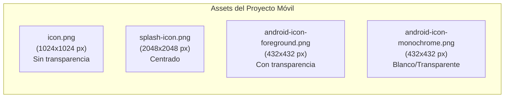
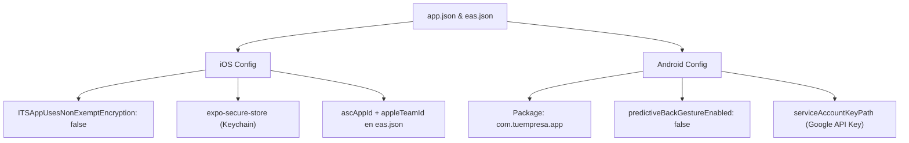

# 📱 Guía Estándar y Checklist de Requisitos para Publicación de Apps Móviles (iOS & Android)

Este documento es una guía visual y lista de cotejo (Checklist SOP) de revisión rápida para cada vez que vayas a desarrollar, actualizar o enviar una aplicación móvil a **Apple App Store** y **Google Play Store** utilizando **Expo / React Native**.

---

## 🚀 1. Stack Técnico y Control de Versiones

### 📦 Especificaciones del Entorno (Expo SDK 54)
```text
┌─────────────────────────┬────────────────────────────────────────────────────────┐
│ Componente              │ Versión / Especificación                               │
├─────────────────────────┼────────────────────────────────────────────────────────┤
│ Framework Móvil         │ Expo SDK ~54.0.0                                       │
│ Navegación              │ Expo Router ~6.0.24                                    │
│ Core                    │ React Native 0.81.5 | React 19.1.0                     │
│ Lenguaje                │ TypeScript con `typedRoutes: true`                     │
│ Herramienta de Build    │ EAS CLI (>= 21.2.0)                                    │
└─────────────────────────┴────────────────────────────────────────────────────────┘
```

### 🔢 Estrategia de Versionado (`app.json` / `eas.json`)
- **`version` (Pública):** e.g., `"1.0.0"` (Visible para los usuarios).
- **`buildNumber` (iOS):** Entero incremental (e.g., `9`).
- **`versionCode` (Android):** Entero incremental (e.g., `9`).
- **Autoincremento:** En `eas.json` bajo el perfil `"production"` definir `"autoIncrement": true`.

---

## 🎨 2. Requisitos Visuales y de Assets Gráficos

### 📱 A. Assets dentro del Código (`/assets/images`)



### 🏪 B. Especificaciones para las Tiendas (Tienda & Capturas)

#### 🍏 Apple App Store (App Store Connect)
```text
┌───────────────────────────┬─────────────────────────────┬──────────────────────────────────────────┐
│ Asset                     │ Dimensiones                 │ Detalles Técnicos                        │
├───────────────────────────┼─────────────────────────────┼──────────────────────────────────────────┤
│ App Store Icon            │ 1024 x 1024 px              │ PNG sin transparencia, 72 DPI, RGB       │
│ Capturas iPhone 6.7"      │ 1290 x 2796 px              │ Mínimo 3 capturas (Ideal 5)              │
│ Capturas iPhone 6.5"      │ 1242 x 2688 px              │ iPhone 11 Pro Max / XS Max               │
│ Capturas iPad 12.9"       │ 2048 x 2732 px              │ Requerido si soporta iPad                │
└───────────────────────────┴─────────────────────────────┴──────────────────────────────────────────┘
```

#### 🤖 Google Play Store (Google Play Console)
```text
┌───────────────────────────┬─────────────────────────────┬──────────────────────────────────────────┐
│ Asset                     │ Dimensiones                 │ Detalles Técnicos                        │
├───────────────────────────┼─────────────────────────────┼──────────────────────────────────────────┤
│ Icono Principal           │ 512 x 512 px                │ PNG 32-bit, máx 1 MB                     │
│ Gráfico de Funciones      │ 1024 x 500 px               │ Feature Graphic portada (JPG/PNG)        │
│ Capturas Teléfono         │ Min: 320px | Max: 3840px    │ Aspect ratio 16:9 / 9:16 (2 a 8 fotos)   │
│ Capturas Tablet 7"/10"    │ Mínimo 1024 x 500 px        │ Requerido para optimización tablet       │
└───────────────────────────┴─────────────────────────────┴──────────────────────────────────────────┘
```

---

## 🔒 3. Requisito Obligatorio: Cancelación y Eliminación de Cuenta

> [!CAUTION]
> **REGLA DE REVISIÓN CRÍTICA (Apple 5.1.1(v) & Google Data Deletion Policy)**
> Si tu aplicación permite el registro de usuarios (`register`), **DEBE incluir obligatoriamente una opción dentro de la app para eliminar o cancelar la cuenta**, borrando todos los datos personales del usuario.

### 📋 Checklist de Cumplimiento:
- [ ] **Acceso Directo:** El botón debe estar dentro de la app (generalmente en la pantalla de Perfil o Ajustes).
- [ ] **Borrado de Datos:** Debe procesar la eliminación completa en el backend o dirigir a un portal web sin fricciones (sin exigir llamadas telefónicas).

```tsx
// Snippet de referencia para incluir en la pantalla de perfil (e.g., profile.tsx)
<TouchableOpacity style={styles.deleteAccountBtn} onPress={handleDeleteAccount}>
  <Ionicons name="trash-outline" size={18} color="#DC2626" />
  <Text style={styles.deleteAccountText}>Eliminar mi cuenta</Text>
</TouchableOpacity>
```

---

## ⚙️ 4. Requisitos de Configuración (`app.json` & `eas.json`)



---

## 🛠️ 5. Comandos de Compilación y Subida Automática (EAS CLI)

```bash
# 🍏 1. Compilar y enviar automáticamente a TestFlight (iOS)
npx eas build --platform ios --profile production --auto-submit

# 🤖 2. Compilar y enviar automáticamente a Prueba Cerrada (Android Alpha)
npx eas build --platform android --profile production --auto-submit

# 🚀 3. Compilar y enviar a ambas plataformas a la vez
npx eas build --platform all --profile production --auto-submit
```

---

## ✅ Checklist Final de Verificación Antes de Publicar

> [!TIP]
> Revisa estos puntos antes de lanzar cualquier build a producción.

- [ ] **Incremento de Build:** `buildNumber` y `versionCode` son mayores que los de la versión en tienda.
- [ ] **HTTPS Enforced:** La URL base de la API (`EXPO_PUBLIC_API_URL`) apunta a `https://`.
- [ ] **Políticas y Términos:** Enlace visible en la app a Términos y Condiciones y Política de Privacidad.
- [ ] **Eliminación de Cuenta:** La función de cancelar/borrar cuenta está visible y operativa.
- [ ] **Assets sin Placeholders:** Todos los iconos, splash screens y capturas de tienda están en alta resolución y sin fallbacks temporales.
